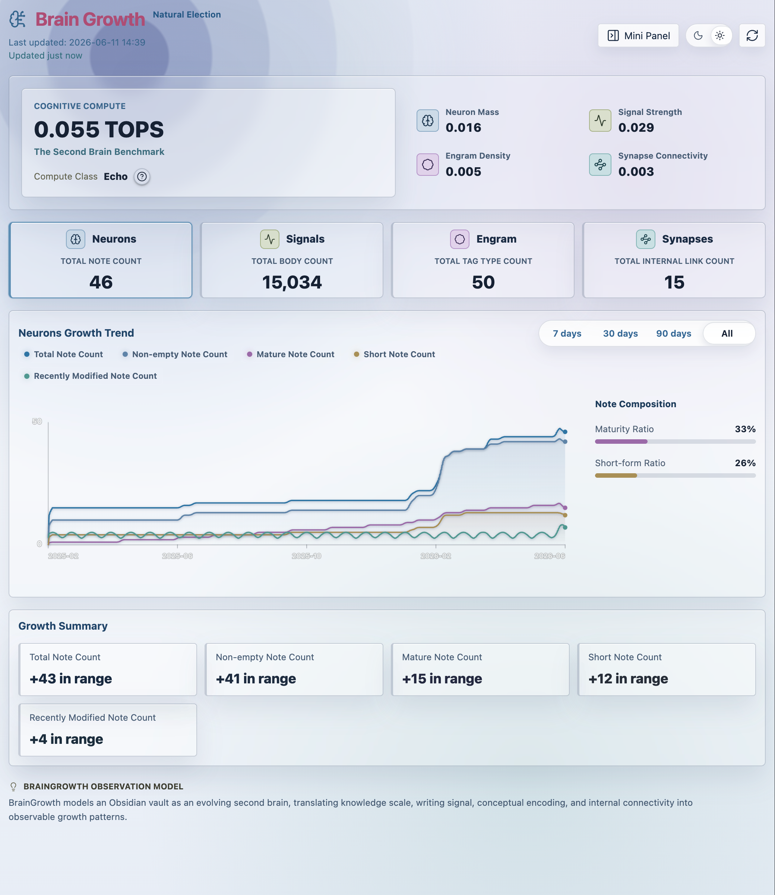
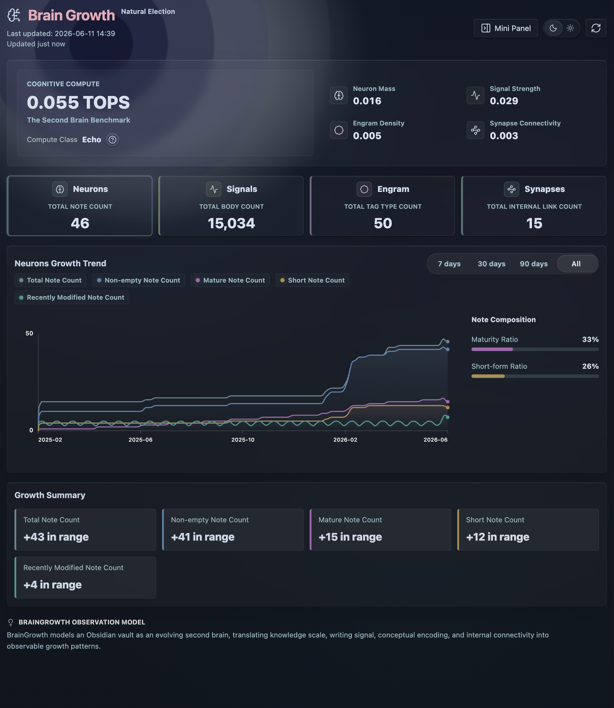
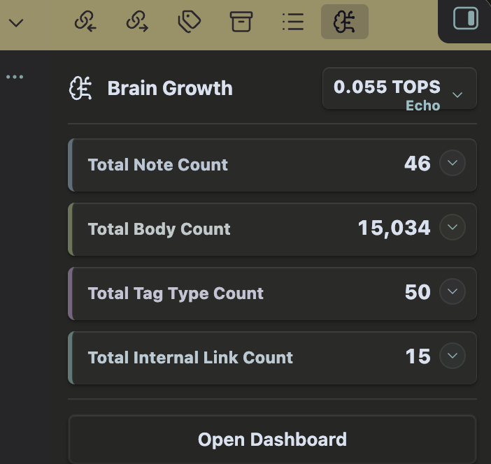

# Brain Growth

Brain Growth tracks how your Obsidian vault grows over time. It scans Markdown notes in your vault, keeps daily local snapshots, and shows growth trends in a dashboard and compact side panel.

## Features

- Track Markdown note count, body count, tags, and internal links.
- View daily growth snapshots in a dedicated dashboard.
- Compare recent ranges with trend cards and charts.
- Open a resident mini panel in the right sidebar.
- Initialize historical growth from existing vault file metadata.
- Switch dashboard background mode between dark and light.

## Screenshots

### Dashboard, light mode



### Dashboard, dark mode



### Mini panel



## Usage

After enabling Brain Growth, use the ribbon icon or the command palette command **Open Brain Growth Mini Panel**.

The plugin refreshes stats when Obsidian starts and when vault changes are detected. Snapshots are stored with the plugin's local data through Obsidian's plugin data API.

## Privacy

Brain Growth works locally inside your vault.

- It does not send vault data to remote services.
- It does not include client-side telemetry or analytics.
- It does not require an account.
- It does not access files outside your Obsidian vault.

## Installation

### From Obsidian community plugins

Once published, install Brain Growth from **Settings -> Community plugins -> Browse**.

### Manual installation

1. Download `main.js`, `manifest.json`, and `styles.css` from the latest GitHub release.
2. Place them in:

```text
<vault>/.obsidian/plugins/brain-growth/
```

3. Enable **Brain Growth** from Obsidian's Community plugins settings.

## Development

Install dependencies:

```bash
npm install
```

Build the plugin:

```bash
npm run build
```

Run tests:

```bash
npm test
```

## Release

1. Update `version` in `manifest.json` and `package.json`.
2. Run `npm run build`.
3. Create a GitHub release whose tag exactly matches the manifest version, for example `0.2.2`.
4. Upload `main.js`, `manifest.json`, and `styles.css` as release assets.

## License

MIT
